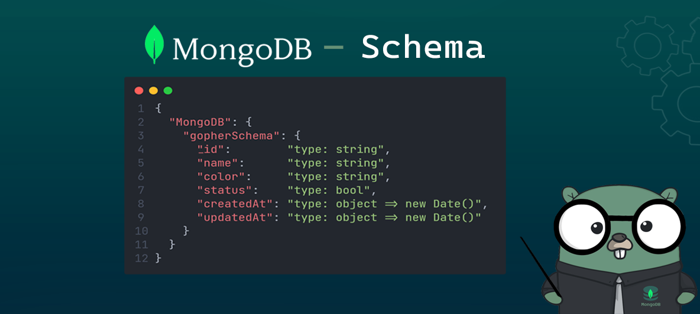
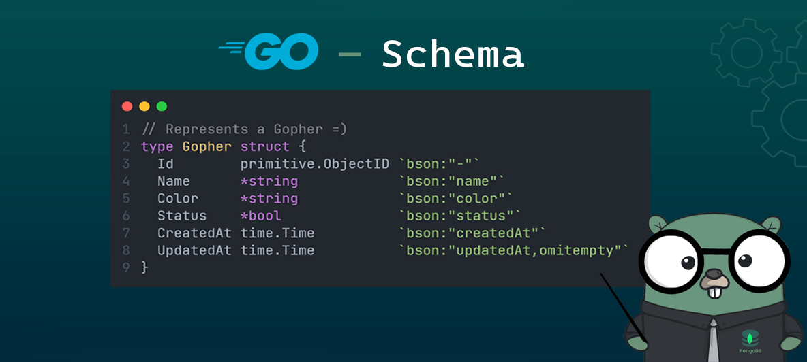

# REST Api - By Moi

## This is a `REST Api` developed in order to practice with Golang x)

<!-- Banner -->


## ⚙️ Project setup

<div style="display: flex; align-items: center">
  
  <a
    href="https://go.dev/doc/install"
    target="_blank"
    style="margin-left: 10px"
  >
    ▾ Install Golang
  </a>
</div>

<br>

<div style="display: flex; align-items: center">
  
  <a
    href="https://www.mongodb.com/docs/manual/installation/"
    target="_blank"
    style="margin-left: 10px"
  >
    ▾ Install MongoDB
  </a>
</div>

<hr>

## 🚀 Run project:

```bash
exec.bat
```
Or

```bash
go run .
```

<hr>

## 👨‍🏫 { Schemas }



<br>



<hr>

## 🧾️ Config file

You can configure the environment variables<br>
in the file `'./config/config.yaml'`

```yaml
# Application
app:
  environment: 'dev'
  host: '127.0.0.1'
  port: 8080
  url: 'http://127.0.0.1:8080'
  endpoint: '/gopher'
db:
  username: ''
  password: ''
  db_name: 'gophersApi'
  db_uri: 'mongodb://127.0.0.1:27017/gophersApi'
```

<hr>

## 📦 Packages used:

<ol>
  <li>
    <a
      href="https://github.com/gofiber/fiber"
      target="_blank"
    >
      🔥 Fiber (Framework)
    </a>
  </li>
  <li>
    <a
      href="https://www.mongodb.com/docs/drivers/go/current/"
      target="_blank"
    >
      🍃 MongoDB Driver
    </a>
  </li>
  <li>
    <a
      href="https://github.com/go-playground/validator"
      target="_blank"
    >
      ✅ Validator
    </a>
  </li>
  <li>
    <a
      href="github.com/spf13/viper"
      target="_blank"
    >
      🐍 Viper
    </a>
  </li>
</ol>
